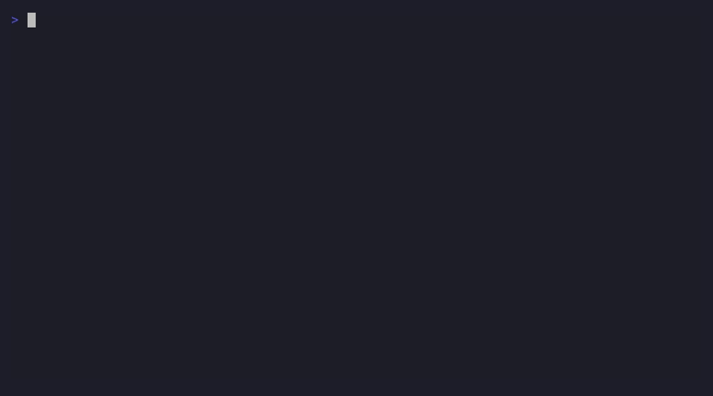

# 🧠 EAN AgentOS

[](LICENSE)
[](https://python.org)
[](test_full.sh)
[](#supported-clis)

### Persistent Memory for AI Coding Agents

**Never solve the same bug twice.**



---

## What does EAN AgentOS do?

Your AI agent forgets everything between sessions. EAN AgentOS gives it permanent memory.

### Demo: "Never solve the same bug twice"

```
SESSION 1 — Monday morning
> Fix CORS error in Flask API
  Agent fixes it: pip install flask-cors && CORS(app)
  ✅ Solution saved to memory.

... 3 months later ...

SESSION 847 — Thursday evening
> I'm getting a CORS error again

🧠 EAN AgentOS: You solved this before.

$ mem suggest 'CORS error'

💡 SOLUTIONS FOR: CORS error
  1. [51pts] ✅ CORS error: blocked by CORS policy
     Solution: Add flask-cors middleware: CORS(app)
     Code:     pip install flask-cors && CORS(app)

# Never solve the same bug twice.
```

**Works with Claude Code, Gemini CLI, Codex CLI, and Kimi CLI.** All agents share the same memory.

---

## Features

| Feature | Description |
|---------|-------------|
| 🔁 **Persistent Memory** | Decisions, facts, goals, tasks — persisted across sessions |
| 💡 **`mem suggest`** | Find past solutions: *"Never solve the same bug twice"* |
| 🧬 **Knowledge Extraction** | Auto-extract patterns, scoring, deduplication |
| 🔍 **Cognitive Search** | Search across resolutions, decisions, facts, messages |
| 🌳 **Memory Branches** | Branch-aware memory per git branch |
| 📊 **Experience Graph** | Problem → solution → outcome graph |
| 🔄 **Cross-Agent Learning** | Agents learn from each other's experience |
| 💾 **Backup & Recovery** | Auto backup, restore, integrity verification |
| 🖥️ **Web Dashboard** | Visualize decisions, facts, timeline, health |
| 🔌 **MCP Server** | Native integration with Claude Code + other CLIs |

---

## Prerequisites

**You need at least one AI coding CLI installed first:**

| CLI | Install | Required? |
|-----|---------|-----------|
| [Claude Code](https://claude.ai/code) | `npm install -g @anthropic-ai/claude-code` | At least one |
| [Gemini CLI](https://github.com/google-gemini/gemini-cli) | `npm install -g @google/gemini-cli` | At least one |
| [Codex CLI](https://github.com/openai/codex) | `npm install -g @openai/codex` | At least one |
| [Kimi CLI](https://github.com/MoonshotAI/kimi-cli) | `pip install kimi-cli` | At least one |

> **Without a CLI, EAN AgentOS has nothing to capture.** Install at least one, then proceed:

## Quick Install

```bash
git clone https://github.com/eanai-ro/ean-agentos.git
cd ean-agentos
./install.sh
```

The installer auto-detects installed CLIs and lets you choose which to integrate.

### Or manually:

```bash
pip install flask flask-cors
python3 scripts/init_db.py
python3 scripts/ean_memory.py install claude   # or gemini, codex
```

---

## Usage

### Never solve the same bug twice

```bash
mem suggest "CORS error"
```

```
💡 SOLUTIONS FOR: CORS error
══════════════════════════════════════════════════════════════

  1. [92pts] ✅ error_resolutions#5
     Problem:  CORS error: blocked by CORS policy
     Solution: Add flask-cors middleware: CORS(app)
     Match: 100% | Confidence: 92% | Agent: claude-code
```

### Key Commands

```bash
mem suggest "error message"   # Find past solutions
mem search "keyword"          # Search all memory
mem decisions                 # View active decisions
mem status                    # Memory status
mem graph stats               # Experience graph stats
```

### Web Dashboard

```bash
python3 scripts/web_server.py
# Open: http://localhost:19876
```

### MCP Server (for Claude Code)

Configured automatically during install. Your AI agent receives context from permanent memory at every session.

---

## Supported CLIs

| CLI | Integration | Install Command |
|-----|-------------|-----------------|
| **Claude Code** | Hooks + MCP Server | `python3 scripts/ean_memory.py install claude` |
| **Gemini CLI** | Hooks | `python3 scripts/ean_memory.py install gemini` |
| **Codex CLI** | Hooks | `python3 scripts/ean_memory.py install codex` |
| **Kimi CLI** | MCP Server | Manual config |

All CLIs read and write to the same database. What one agent learns is available to all.

---

## How It Works

```
  Claude Code    Gemini CLI    Codex CLI    Kimi CLI
       │              │             │            │
       │     auto-capture (hooks)                │
       └──────────────┬─────────────┬────────────┘
                      │             │
                      ▼             ▼
               ┌──────────────────────────┐
               │       global.db          │
               │                          │
               │  decisions               │
               │  learned_facts           │
               │  error_resolutions       │
               │  experience_graph        │
               │  solution_index          │
               │  ...52 tables            │
               └──────────────────────────┘
                      │
          ┌───────────┼───────────┐
          ▼           ▼           ▼
      REST API    MCP Server    CLI (mem)
       Dashboard   (Claude)     (terminal)
```

1. **Capture**: Hooks auto-capture decisions, errors, solutions from AI sessions
2. **Structure**: Knowledge Extractor classifies, scores, and deduplicates
3. **Retrieve**: At each new session, the agent receives relevant context
4. **Learn**: Solution Index + Experience Graph = memory gets smarter

---

## Project Structure

```
ean-agentos/
├── scripts/
│   ├── mem                      # Main CLI
│   ├── v2_common.py             # Core DB + utilities
│   ├── init_db.py               # DB initialization
│   ├── solution_index.py        # 💡 mem suggest
│   ├── knowledge_extractor.py   # Auto-extraction
│   ├── context_builder_v2.py    # LLM context builder
│   ├── experience_graph.py      # Experience graph
│   ├── search_memory.py         # Unified search
│   ├── backup_manager.py        # Backup & restore
│   ├── web_server.py            # Web dashboard
│   ├── ean_memory.py            # Installer
│   └── ...
├── web/                         # Dashboard HTML/JS/CSS
├── mcp_server/                  # MCP for Claude Code
├── mcp-server/                  # MCP for Kimi CLI
├── migrations/                  # DB schema
├── install.sh                   # Interactive installer
├── test_full.sh                 # Test suite (48 tests)
└── Dockerfile                   # Test container
```

---

## Testing

```bash
./test_full.sh
```

48 tests covering: structure, database, imports, mem suggest, experience graph, context builder, search, web server, MCP, DB integrity, backup.

---

## Free vs Pro — What You Get

### Free (this repo) — Full persistent memory system

| Feature | Included |
|---------|----------|
| ✅ Persistent memory (decisions, facts, goals, tasks, errors) | **Yes** |
| ✅ `mem suggest` — find past solutions instantly | **Yes** |
| ✅ Knowledge extraction with pattern detection | **Yes** |
| ✅ Experience graph (problem → solution → outcome) | **Yes** |
| ✅ Context builder (compact/full/survival) | **Yes** |
| ✅ Cognitive search across all memory | **Yes** |
| ✅ Cross-agent learning | **Yes** |
| ✅ Branch-aware memory | **Yes** |
| ✅ Backup & recovery | **Yes** |
| ✅ Web dashboard | **Yes** |
| ✅ MCP server (Claude Code integration) | **Yes** |
| ✅ CLI tool (`mem`) with 30+ commands | **Yes** |
| ✅ Hooks for Claude Code, Gemini CLI, Codex CLI, Kimi CLI | **Yes** |
| ✅ 52 database tables, 48 tests | **Yes** |

### Pro 🔒 — Everything in Free + multi-agent orchestration

**Pro includes the full Free edition** (persistent memory, `mem suggest`, knowledge extraction, dashboard, all CLI integrations) **plus** multi-agent orchestration capabilities:

| Feature | Free | Pro |
|---------|------|-----|
| Persistent memory, `mem suggest`, knowledge extraction | ✅ | ✅ |
| Web dashboard, MCP server, 30+ CLI commands | ✅ | ✅ |
| All 4 CLI integrations (Claude, Gemini, Codex, Kimi) | ✅ | ✅ |
| Multi-agent orchestration (projects, tasks, leases) | — | ✅ |
| AI deliberation (multi-round, voting, synthesis) | — | ✅ |
| CLI Launcher (launch Claude/Gemini/Codex/Kimi programmatically) | — | ✅ |
| Auto-pipeline (task chaining, auto-review, conflict resolution) | — | ✅ |
| Intelligence layer (capability scoring, weighted voting) | — | ✅ |
| Skill learning (learns from reviews) | — | ✅ |
| Replay system (project + deliberation timelines) | — | ✅ |
| Peer review workflow (formal verdicts, auto-fix) | — | ✅ |

#### Pro Demo: VPS Security Hardening — 3 Agents Deliberate


> 3 AI agents propose, critique each other, and reach consensus on a 16-point VPS hardening checklist. No single agent covered all points — the mutual critique filled the gaps. [Full demo →](demos/demo_vps_hardening.md)

**Contact for Pro**: [ean@eanai.ro](mailto:ean@eanai.ro)

---

## Live Demos (Pro)

Real output from multi-agent orchestration sessions — [see all demos](demos/README.md):

| Demo | What it shows |
|------|--------------|
| [Architecture](demos/demo_architecture.md) | 3 agents design a REST API (testing + security + backend) |
| [SQL vs NoSQL](demos/demo_database.md) | Agents debate, disagree, and reach consensus |
| [Code Review](demos/demo_code_review.md) | 3 agents find the same vulnerability independently |
| [Security Audit](demos/demo_security_audit.md) | SQL injection + weak JWT found by all 3 agents |
| [VPS Hardening](demos/demo_vps_hardening.md) | Full deliberation: propose → critique → 16-point checklist |
| [Debugging](demos/demo_debugging.md) | 3 agents diagnose a production memory leak |
| [CI/CD Pipeline](demos/demo_cicd.md) | Agents design deployment pipeline together |
| [Performance](demos/demo_performance.md) | 3 agents optimize a slow API endpoint |

---

## License

MIT — see [LICENSE](LICENSE)

---

## About

Built by **EAN** (Encean Alexandru Nicolae) 🇷🇴

*Persistent memory for AI agents. Don't forget. Don't repeat. Learn.*
